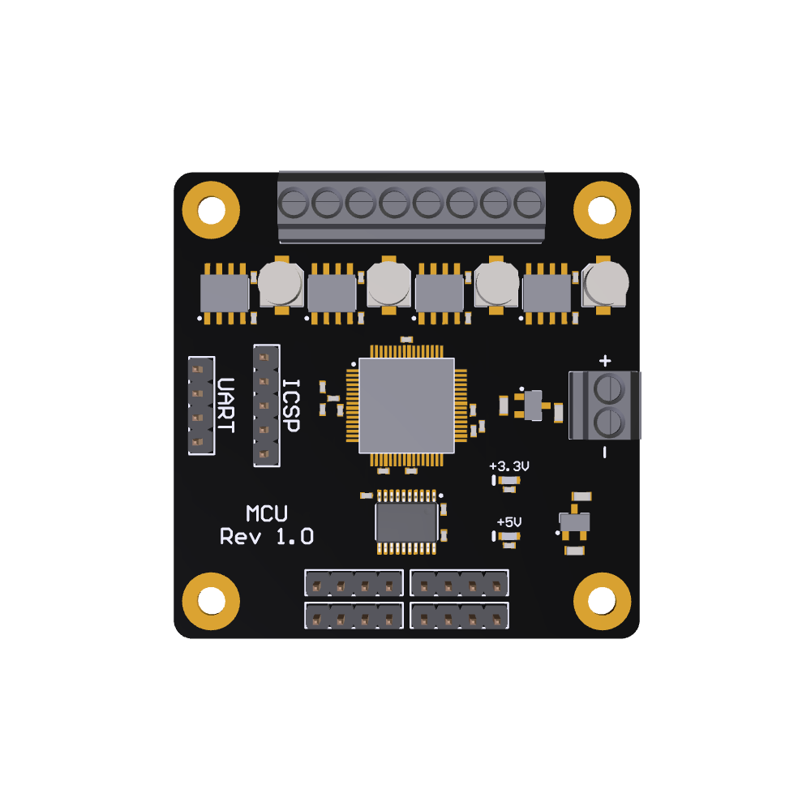

# Motion Control Unit (MCU)

MCU is a development board built around the PIC32MK series of microcontrollers from Microchip. This device was specifically for the up to 6 Quadrature Encode Interfaces (QEI) it offers. This board will make control of two and four wheeled robots with quadrature encoder equipped motors seamless. 

Specifications:
- UART interface for communication with host
- ICSP interface for programming
- 6.5V to 12V supply voltage
- x4 5V encoder interfaces
- x4 motor interfaces
  - 6.5V to 12V motor voltage
  - 3.6A peak current

